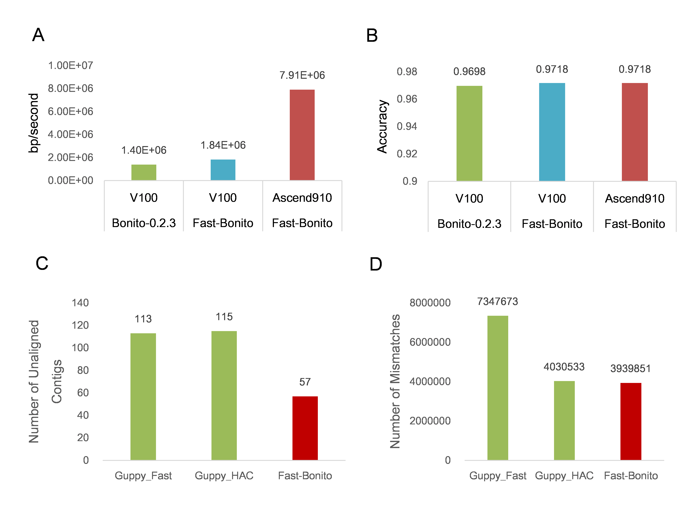

# Fast-Bonito

Oxford Nanopore Technologies (ONT) is a promising sequencing technology that 
could generate relatively longer sequencing reads compared to the next 
generation sequencing (NGS) technology. The base calling process for ONT,
translating the original electrical current signals into the nucleotide 
sequence, could directly and significantly influence the quality of 
downstream analysis. [Bonito](https://github.com/nanoporetech/bonito) 
is a deep learning based basecaller recently developed by ONT, its neuron 
network architecture is composed of a single convolutional layer followed 
by three stacked bidirectional GRU layers. Although Bonito achieved the 
state-of-the-art basecalling accuracy, its speed is too slow to be used 
in production. We therefore develop 
[Fast-Bonito]((https://doi.org/10.1101/2020.10.08.318535)), by using neural 
architecture search technology to search for a brand new backbone, and 
train it from scratch using several advanced deep learning model training
technologies, the new model balanced both at the speed and the accuracy. 
Fast-Bonito archives 153.8% faster than original Bonito on NVIDIA V100. 
Going further, by using HUAWEI Ascend 910 NPU, Fast-Bonito achieves 565% 
faster than original Bonito. The accuracy of Fast-Bonito is also slightly 
higher than the Bonito. We make Fast-Bonito open source available and wish 
it could boost the use of TGS in both academic research and industries.


## Performance of FastBonito

- On NVIDIA V100, Fast-Bonito archives 153.8% faster than Bonito.
- On HUAWEI Ascend 910 NPU, Fast-Bonito achieves 565% faster than Bonito.
- The accuracy of Fast-Bonito is also slightly higher (0.2%) than Bonito.

> 
> A). On NVIDIA V100, Fast-Bonito is 153.8% faster Bonito. While on Asscend 910 NPU, Fast-Bonito is 565% faster than Bonito. B). The accuracy of basecalling of Fast-Bonito is slightly higher than Bonito (by 0.2%). Fast-Bonito achieves the least number of unaligned contigs C) and mismatches D), when aligned the assembly contigs to the reference genome, compared with ¡°Guppy Fast¡± and ¡°Guppy HAC¡± mode.


## Usage

```python
python basecaller.py --model_directory MODEL_DIRECTORY \
    --reads_directory READS_DIRECTORY \
    --beamsize BEAMSIZE \
    --fastq \
    --chunksize CHUNKSIZE \
    --overlap OVERLAP \
    --batch_size BATCH_SIZE \
    --read_multiprocess READ_MULTIPROCESS \
    --decode_multiprocess DECODE_MULTIPROCESS \
    --queue_size QUEUE_SIZE \
    --output OUTPUT \
    --device DEVICE
```

- model_directory: model directory contains the model;
- reads_directory: directory contains fast5 files;
- beamsize: default 5. The number of search points should be kept at each 
step. Higher numbers are less likely to discard the true labelling, but 
also make it slower and more memory intensive;
- fastq: whether to output fastq format file;
- chunksize: the size of chunk, default 6000;
- overlap: the overlap between two chunks, default 300; 
- batch_size: batch size of each inference, default 200;
- read_multiprocess: number of process for process data before inferencing;
- decode_multiprocess: number of process for decoding;
- queue_size: size of queue to store the processed data;
- output: output file path;
- device: inference device, "npu" on D910 or "cuda" on NVIDIA.

## Example


```bash
# define input and output paramerters
INPUT_FAST5_DIR="input_fast5"  # input fast5 directory
OUTPUT_BASECALL_DIR="output"  # output directory
OUTPUT_NAME_BASECALL="test.fasta"  # output fasta name

# running fast-bonito 
python basecaller.py --reads_directory $INPUT_FAST5 --output \
/$OUTPUT_BASECALL/${OUTPUT_NAME_BASECALL}
```

## Requirements

- ont_fast5_api==3.0.1
- fast-ctc-decode==0.2.5
- torch==1.4.0
- tqdm==4.31.1
- numpy==1.19.2
- scipy==1.5.2
- tensorflow-gpu==1.14.0
- mappy==2.17
- ***Ascend 910 NPU Driver***

## Ananconda Setup  

``` {bash}
# Setup environment using conda
# use env_gpu.yml for GPU server
# use env_ascend.yml for GPU server

conda env create -f env_gpu.yml 
conda env update -f env_gpu.yml
source activate fast-bonito

# Install fast-bonito
git clone https://github.com/EIHealth-Lab/fast-bonito.git
cd fast-bonito
python setup.py install 
#OR: python setup.py bdist_wheel; pip install dist/*.whl
```

## Docker Setup  

```bash
# build
docker build -f Dockerfile_fast_bonito -t fast-bonito:0.2.2 .

# run
nvidia-docker run -it --rm --ipc host \
    -v ${INPUT_FAST5_DIR}:/input_data \
    -v ${OUTPUT_BASECALL_DIR}:/output \
    swr.cn-north-4.myhuaweicloud.com/fast-bonito/fast-bonito:0.2.2 \
    sh -c "cd /workspace/fast-bonito/ && \
           python basecaller.py \
            --reads_directory $INPUT_FAST5_DIR \
            --output /$OUTPUT_BASECALL_DIR/${OUTPUT_NAME_BASECALL}"
```

## TODO

- [ ] 20/12/16 add env_ascend.yml for Ascend 910 NPU
- [ ] 20/12/16 add logger
- [ ] 20/12/17 add setup file

## License
This software is part of a Huawei internal research project based on 
[Bonito](https://github.com/nanoporetech/bonito), we make it available to the 
public under the same license as Bonito in hope it could be useful.

Oxford Nanopore Technologies, Ltd. Public License Version 1.0

## Notice
Fast-bonito was developped based on [Bonito](https://github.com/nanoporetech/bonito)
of version 0.2.2. In the process of basecalling, we made some modifacations to speed 
up Bonito. Firstly, parallel processing was used to preprocess data. Secondly, model 
was loaded from pb file and data were feed to model with shape of (200, 1, 1, 6000), 
which can inference several short reads in one batch or a long read in different 
batchs.  

## Citation
Zhimeng Xu, Yuting Mai, Denghui Liu, Wenjun He, Xinyuan Lin, Chi Xu, Lei Zhang, 
Xin Meng, Joseph Mafofo, Walid Abbas Zaher, Yi Li, Nan Qiao. Fast-Bonito: A Faster
Basecaller for Nanopore Sequencing. bioRxiv 2020.10.08.318535; doi: 
[https://doi.org/10.1101/2020.10.08.318535](https://doi.org/10.1101/2020.10.08.318535).
